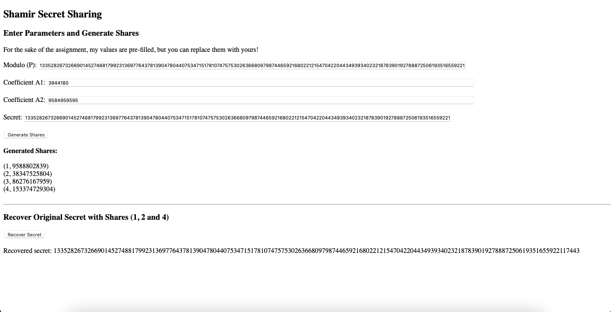

# INTE2401-SecretSharing

Cloud Security, Assignment 3, Question 2

Author: Daniel Viglietti s3844180

Date: 20/05/2022

JavaScript Web Interface for Paillier Encryption Algorithm

Dependencies: BigInteger.js library

This is the basic interface, for my sake all the parameters are filled, but can be replaced with your values. (Note that P must be a prime number bigger than the secret, and Co-efficients A and B must be between 0 and P);

This is the generation of shares, all the maths is performed in JavaScript and then outputs the bigIntegers as base 10.

This is the recovery using, for my assignment, shares 1, 2 and 4. As you can see, it recovers the key without issue.